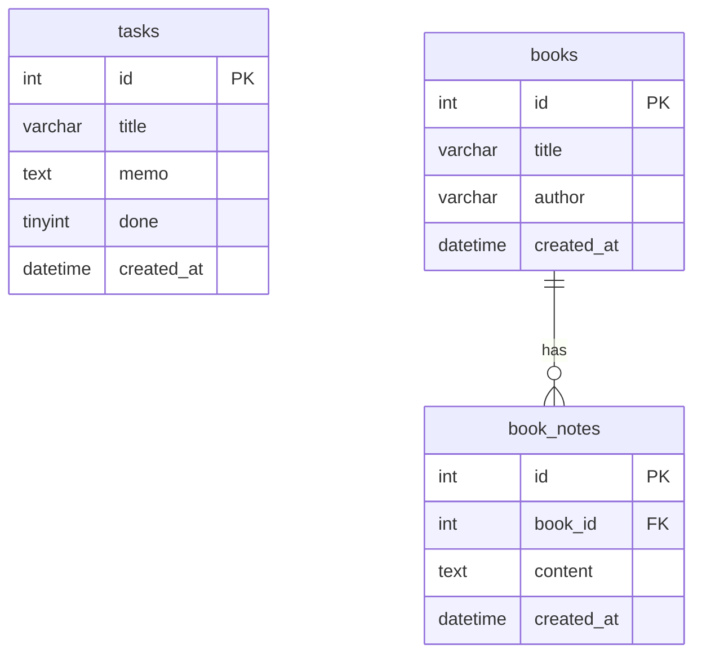

# Reading & Task Board

個人メモ＆タスク管理アプリ（**学習用・非公開**）

## 必要環境

| ソフトウェア | バージョン目安 |
|-------------|----------------|
| Node.js | LTS（v20+ 推奨） |
| Python | 3.11+ |
| MySQL | 8.x |
| Git | 最新 |
| GitHub アカウント | Private リポジトリ用 |

## 初回セットアップ

### 1. リポジトリを clone

```powershell
git clone https://github.com/masafu-ya/reading-task-board.git
cd reading-task-board
```

### 2. MySQL の準備

```powershell
.\mysql\start-mysql.ps1
Get-Content .\mysql\init.sql | & "C:\Program Files\MySQL\MySQL Server 8.4\bin\mysql.exe" -u root -p
```

### 3. Backend の環境変数

```powershell
cd backend
copy .env.example .env
# .env を編集して DB_PASSWORD を設定
python -m venv venv
.\venv\Scripts\activate
pip install -r requirements.txt
```

### 4. Frontend の環境変数

```powershell
cd ..\frontend
copy .env.local.example .env.local
npm install
```

## 起動方法（毎回）

**順番が重要**: MySQL → Backend → Frontend

### 1. MySQL

```powershell
cd "D:\cursolアプリ\サンプルプロジェクト１"
.\mysql\start-mysql.ps1
```

### 2. Backend（port 8000）

```powershell
cd backend
.\start.ps1
```

### 3. Frontend（port 3000）

```powershell
cd frontend
npm run dev
```

ブラウザで http://localhost:3000 を開く

## テストの実行（Day 12）

**Backend（pytest）** — MySQL 起動が必要

```powershell
cd backend
.\venv\Scripts\activate
pip install -r requirements-dev.txt
pytest -v
```

**Frontend（Vitest）**

```powershell
cd frontend
npm test
```

## 環境変数一覧

### backend/.env

| 変数 | 例 | 説明 |
|------|-----|------|
| DB_HOST | localhost | MySQL ホスト |
| DB_PORT | 3306 | MySQL ポート |
| DB_USER | root | MySQL ユーザー |
| DB_PASSWORD | （秘密） | MySQL パスワード |
| DB_NAME | learning_app | データベース名 |

### frontend/.env.local

| 変数 | 例 | 説明 |
|------|-----|------|
| NEXT_PUBLIC_API_URL | http://localhost:8000 | FastAPI の URL |

## 技術スタック

| 役割 | 技術 |
|------|------|
| フロント | Next.js + TypeScript + Tailwind |
| API | Python FastAPI |
| DB | MySQL |
| 開発 | Cursor |
| 履歴 | GitHub（Private） |

## フォルダ構成

```
サンプルプロジェクト１/
├── frontend/              # Next.js
│   └── src/
│       ├── app/           # ページ（/, /books, /about）
│       ├── components/    # UI 部品
│       ├── hooks/         # useTasks, useBooks など
│       ├── lib/           # API 通信
│       └── types/         # TypeScript 型定義
├── backend/               # FastAPI
├── mysql/                 # MySQL 起動スクリプト・SQL
├── LEARNING_CURRICULUM.md
└── README.md
```

## 主な機能

- **タスク** … CRUD + 検索（SQL LIKE）
- **読書メモ** … 本の登録 + メモ（1対多）

## データベース構成（ER 図）



## 学習カリキュラム

- **Part 1（Day 0〜10）**: `LEARNING_CURRICULUM.md` — v0.1.0 まで
- **Part 2（Day 11〜15）**: 同ファイル Part 2 セクション — 認証・テスト・Docker・デプロイ（v0.2.0）
- 振り返り: `REFLECTION.md`

## バージョン

- **v0.1.0** … 10日間カリキュラム完成版（タスク + 読書メモ + 検索）
- **v0.2.0 開発中** … Day 11 以降: JWT 認証・テスト・Docker・デプロイ

## Day 11: 認証（JWT）セットアップ

既存 DB を使っている場合、マイグレーションを **1 回** 実行してください。

```powershell
cd backend
.\venv\Scripts\activate
pip install -r requirements.txt
cd ..
.\mysql\migrate-day11.ps1
```

`backend/.env` に以下を追加（`.env.example` 参照）:

| 変数 | 説明 |
|------|------|
| JWT_SECRET | 長いランダム文字列（Git に含めない） |
| JWT_EXPIRE_MINUTES | トークン有効期限（分） |

## 注意

- `.env` / `.env.local` は Git に含めない
- リポジトリは **Private** のまま運用
