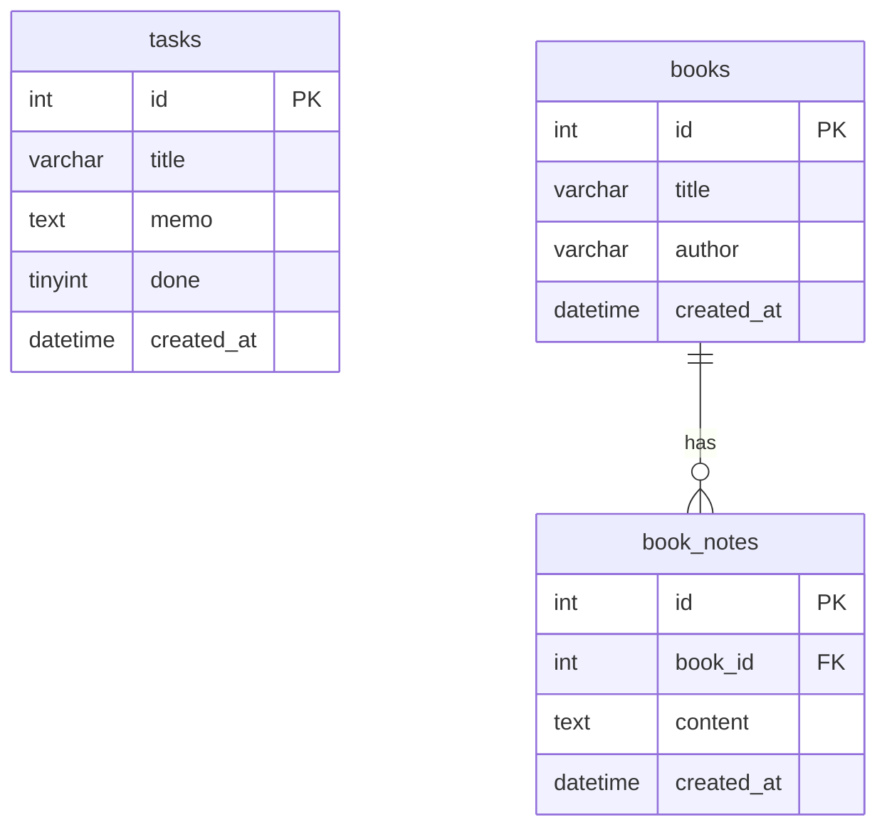

# Reading & Task Board

個人メモ＆タスク管理アプリ（**学習用・非公開**）

## 技術スタック（予定）

| 役割 | 技術 |
|------|------|
| フロント | Next.js + TypeScript + Tailwind |
| API | Python FastAPI |
| DB | MySQL |
| 開発 | Cursor |
| 履歴 | GitHub（Private） |

## フォルダ構成

```
サンプルプロジェクト１/
├── frontend/              # Next.js
│   └── src/
│       ├── app/           # ページ（/, /books, /about）
│       ├── components/    # UI 部品
│       │   └── ui/        # 共通コンポーネント
│       ├── hooks/         # useTasks, useBooks など
│       ├── lib/           # API 通信（http.ts, tasks-api.ts）
│       └── types/         # TypeScript 型定義
├── backend/               # FastAPI
├── mysql/                 # MySQL 起動スクリプト等
├── LEARNING_CURRICULUM.md
└── README.md
```

## 起動方法

### 1. MySQL

```powershell
.\mysql\start-mysql.ps1
```

### 2. Backend（port 8000）

```powershell
cd backend
.\start.ps1
```

### 3. Frontend（port 3000）

```powershell
cd frontend
npm run dev
```

ブラウザで http://localhost:3000 を開く

## データベース構成（ER 図）



- **tasks** … タスク管理（Day 5〜）
- **books** … 読書する本（Day 7〜）
- **book_notes** … 本に紐づくメモ（1対多、CASCADE 削除）

## 学習カリキュラム

`LEARNING_CURRICULUM.md` を参照（10日間）

## 注意

- `.env` ファイルは Git に含めない
- リポジトリは **Private** のまま運用
